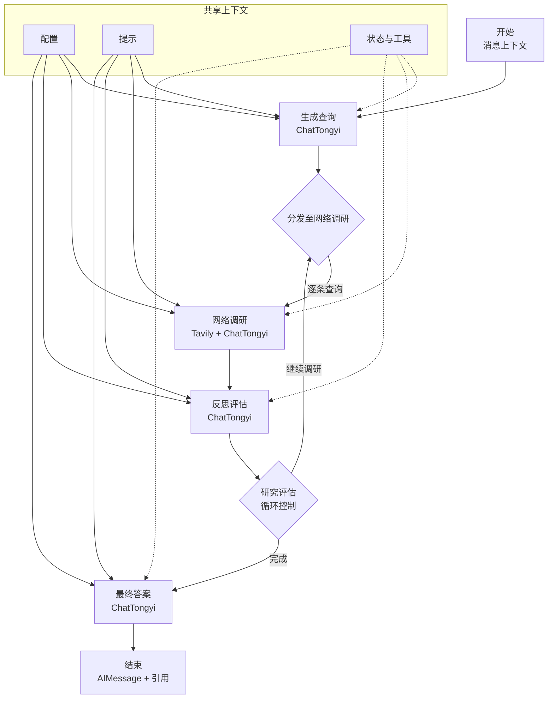

# Pro 搜索智能体架构

本文档简要介绍 `backend/src/agent` 目录中 LangGraph 智能体的核心流程。

## 概览

- 配置模块（`backend/src/agent/configuration.py`）提供模型与循环参数，并支持环境变量覆盖默认值。
- 状态定义（`backend/src/agent/state.py`）声明 LangGraph 的累积逻辑，用于汇总查询、摘要和引用。
- 提示模板（`backend/src/agent/prompts.py`）为工作流各阶段提供中文指令文本。
- 工具函数（`backend/src/agent/utils.py`）统一对话主题抽取与引用格式化。
- 主图逻辑（`backend/src/agent/graph.py`）将 Tavily 搜索与 ChatTongyi 推理组合成迭代式调研流程。

## 流程

