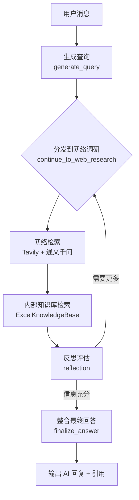

# Pro Search Agent

面向检测认证（TIC）从业者的多阶段调研 Agent。系统会自动判断问题是否属于行业 / 赛道级别，结合 Tavily 在线检索、Excel 内部知识库和通义千问模型，产出带引用的调研结论。

## 功能亮点

- **LangGraph 多节点工作流**：查询生成 → Web 检索 → 内部知识库 → 反思迭代 → 最终答复，全链路可追踪。
- **行业自动识别**：针对“水冷板”“车规级连接器”等宽泛问题自动切换“行业报告模式”，附带客户清单、TIC 需求图谱和行动建议。
- **Excel 向量知识库**：默认加载 `eastmoney_concept_constituents.xlsx` 与 `sw_third_industry_constituents.xlsx`，支持 DashScope 或本地 `sentence-transformers` 嵌入，索引缓存于 `.kb_cache/`。
- **可视化调试台**：`streamlit_app.py` 提供调研问题输入、运行状态和引用展示，便于业务侧快速验证。
- **高度可配置**：`backend/src/agent/configuration.py` 支持环境变量、LangGraph Config Override 以及 Streamlit 侧配置项（模型、循环次数、是否启用知识库等）。

## 目录速览

| 目录 / 文件 | 说明 |
| --- | --- |
| `backend/src/agent/graph.py` | LangGraph 主流程，包含各节点实现与辅助函数 |
| `backend/src/agent/prompts.py` | 查询生成、Web 检索、反思、最终回答、行业报告等提示词 |
| `backend/src/agent/knowledge_base.py` | Excel → FAISS 向量库构建与检索 |
| `backend/knowledge/init_kb.py` | CLI 工具：预构建或刷新知识库缓存 |
| `backend/dataflow/*.py` | 使用 AkShare 拉取行业/概念成分股的脚本 |
| `streamlit_app.py` | Streamlit 前端调研台 |
| `langgraph.json` | LangGraph 入口声明（Graph + FastAPI app） |
| `examples/test.py` | 最小示例：直接调用 Graph 进行调研 |

## 环境准备

1. **Python & 依赖**（建议 Python ≥ 3.10）：
   ```bash
   python -m venv .venv
   .\.venv\Scripts\activate          # Windows PowerShell
   pip install -U pip
   pip install streamlit langgraph langchain-core langchain-community \
       tavily-python python-dotenv pandas numpy akshare requests \
       faiss-cpu sentence-transformers dashscope
   ```
   如需使用本地嵌入（`knowledge_base_embedding_backend=local`），请确保 `sentence-transformers` 可用且机器具备相应算力。

2. **环境变量 `.env`**：项目示例（请替换为自己的 key）。
   ```env
   TAVILY_API_KEY=tvly-xxxxxxxxxxxxxxxxxxxxxxxxxxxx
   DASHSCOPE_API_KEY=sk-xxxxxxxxxxxxxxxxxxxxxxxxxxxx
   DASHSCOPE_BASE_URL=https://dashscope.aliyuncs.com/compatible-mode/v1  # 非必需
   # 可选：KNOWLEDGE_BASE_PATHS、自定义模型名等
   ```
   Streamlit 与 LangGraph 均默认读取仓库根目录的 `.env`。

## 构建 Excel 知识库缓存（可选但推荐）

`ExcelKnowledgeBase` 会在首次检索时自动读取 Excel 并写入 `.kb_cache/`，也可以手动预构建：

```bash
python backend/knowledge/init_kb.py \
    --paths eastmoney_concept_constituents.xlsx,sw_third_industry_constituents.xlsx \
    --embedding-model text-embedding-v3 \
    --embedding-backend dashscope \
    --cache-dir .kb_cache
```

常用参数：

| 参数 | 说明 |
| --- | --- |
| `--paths` | 逗号分隔的 Excel 路径，可覆盖 `KNOWLEDGE_BASE_PATHS` |
| `--embedding-model` | DashScope 文本嵌入模型或 HuggingFace 模型名 |
| `--embedding-backend` | `dashscope` / `local` |
| `--batch-size` | 调用嵌入 API 的批大小（DashScope 最多 10） |
| `--cache-dir` | 指定缓存输出目录 |
| `--dotenv` | 自定义 `.env` 路径 |

## 启动方式

### 1. 直接调用 LangGraph（开发 / 调试）

```bash
langgraph dev            # 读取 langgraph.json，启动 Graph + FastAPI
```

或在 Python 中：
```python
from agent.graph import graph
from agent.state import OverallState
from langchain_core.messages import HumanMessage

state = OverallState(
    messages=[HumanMessage(content="水冷板")],
    search_query=[],
    web_research_result=[],
    sources_gathered=[],
    initial_search_query_count=3,
    max_research_loops=1,
    research_loop_count=0,
    reasoning_model="qwen-plus",
)
result = graph.invoke(state, config={"configurable": {}})
print(result["messages"][-1].content)
```

### 2. Streamlit 调研台

```bash
streamlit run streamlit_app.py
```

在浏览器中：
1. 输入调研问题（如“水冷板”）。
2. 点“开始调研”，查看执行状态与引用。
3. 侧边栏可调整初始查询条数、循环次数、是否启用知识库等参数。

## 工作流概览



## 常用配置项

| 配置字段 | 说明 | 默认值 |
| --- | --- | --- |
| `number_of_initial_queries` | 初始检索条数 | 3 |
| `max_research_loops` | 反思迭代次数上限 | 2 |
| `llm_backend` | `dashscope` / `local`，决定是否调用通义千问 | `dashscope` |
| `enable_knowledge_base_search` | 是否执行内部知识库检索 | True |
| `knowledge_base_paths` | Excel 列表（逗号分隔） | `eastmoney_concept_constituents.xlsx,sw_third_industry_constituents.xlsx` |
| `knowledge_base_embedding_backend` | `dashscope` 或 `local` | `dashscope` |
| `enable_industry_report_mode` | 是否开启行业自动识别 | True |
| `industry_report_auto_detect` | 根据输入自动判断是否套行业模版 | True |
| `industry_report_min_kb_hits` | 行业模式所需的知识库命中下限 | 2 |

配置的优先级：**LangGraph Config（/ Streamlit 输入） > 环境变量 > `Configuration` 默认值**。


## 其他

- 需要新增行业词库 / 风险提示，可在 `graph.py` 中的 `_build_*_queries` 或 `_is_broad_topic` 填充规则。
- 若要支持新的检索 API，可进一步抽象 `web_research` 节点，保留 `replace_citation_tokens` 接口即可。


