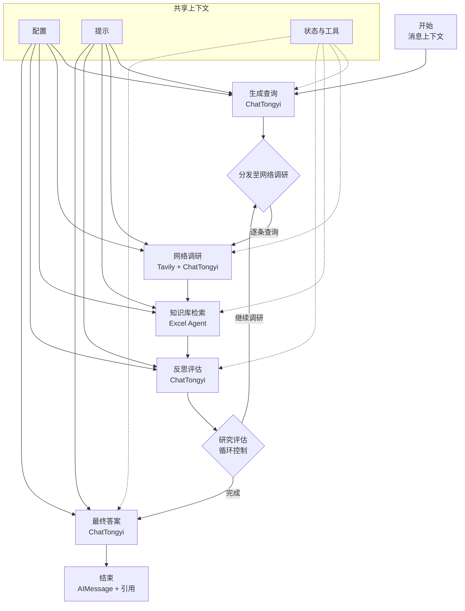

# Pro 搜索智能体架构

本文档简要介绍 `backend/src/agent` 目录中 LangGraph 智能体的核心流程。

## 概览

- 配置模块（`backend/src/agent/configuration.py`）提供模型与循环参数，并支持环境变量覆盖默认值。
- 状态定义（`backend/src/agent/state.py`）声明 LangGraph 的累积逻辑，用于汇总查询、摘要和引用。
- 提示模板（`backend/src/agent/prompts.py`）为工作流各阶段提供中文指令文本。
- 工具函数（`backend/src/agent/utils.py`）统一对话主题抽取与引用格式化。
- 数据知识库（`backend/src/agent/knowledge_base.py`）负责将 `eastmoney_concept_constituents.xlsx` 与 `sw_third_industry_constituents.xlsx` 两份 Excel 构建成基于 FAISS 的本地向量知识库，并把索引与文档内容持久化到 `.kb_cache/`，按文件路径、大小及修改时间生成哈希，在原始 Excel 改动时自动触发重建。
- 主图逻辑（`backend/src/agent/graph.py`）将 Tavily 搜索与 ChatTongyi 推理组合成迭代式调研流程。

## 流程



## 内部知识库 Agent

新增的“知识库检索”节点会在每次网络调研之后运行：

1. 读取配置项 `knowledge_base_paths`，将两个 Excel 文件按行展开为统一的文档集合，并缓存到内存。
2. 默认使用 Qwen 向量模型（DashScope API）编码，每条记录生成语义向量并写入 FAISS `IndexFlatIP`；亦可将 `knowledge_base_embedding_backend` 设置为 `local`，改用 SentenceTransformer 模型离线编码，便于在无法联网时调试。
3. 将这些记录连同唯一的 `kb://` 引用编号注入提示词，调用 ChatTongyi 生成带 `[K#]` 引用的结构化摘要。
4. 通过原有的 `replace_citation_tokens` 工具把引用替换为 Markdown 链接，并把结果视为额外的研究摘要，供反思与最终回答阶段一并使用。

因此，用户提问（例如“PCB 增长较好的企业分析”）时，智能体会先完成联网搜索，再基于两份 Excel 知识库补充企业及财务数据，最后以融合了外部和内部来源的内容进行回复。

## 知识库初始化脚本

- `backend/knowledge/init_kb.py` 提供命令行工具，可在启动 LangGraph 之前手动构建或刷新知识库缓存。脚本会加载 `.env`（或 `--dotenv` 指定文件），读取 `Configuration` 默认值，并允许通过 CLI 参数覆盖 Excel 路径、嵌入模型/后端以及批大小。
- 典型用法：

  ```bash
  python backend/knowledge/init_kb.py \
      --paths eastmoney_concept_constituents.xlsx,sw_third_industry_constituents.xlsx \
      --embedding-model text-embedding-v3 \
      --embedding-backend dashscope
  ```

- 运行完成后，会在 `.kb_cache/`（或 `--cache-dir` 指定目录）生成 `.faiss` 与 `.json` 文件，LangGraph/Streamlit 在加载 `ExcelKnowledgeBase` 时会自动复用这些缓存，除非检测到 Excel 或配置发生变化。
